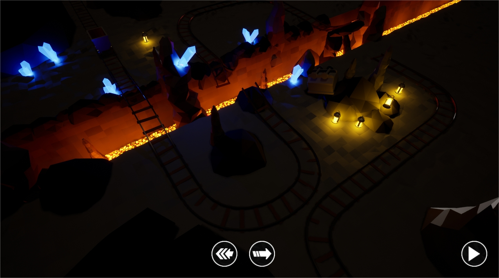

# Wheels Up !



Wagon game *(nom temporaire)* est un jeu de simulation en vue de dessus controllé à la souris.
Chaque niveau est montré dans son ensemble et il faut faire arriver le wagon à son objectif.

Chaque phase de jeu se déroule en deux temps :

* La **phase de préparation** dans laquelle le joueur peux déposer des actions à la surface des rails pour donner des instructions au wagon quand il les atteindra.
* La **phase de simulation** dans laquelle le wagon commence à avancer et suis les actions qui on été définis par le joueur. Celui-ci n'as plus de contrôle sur les actions qu'il peux déposer et peux uniquement constater le crash de son wagon si celui ci va trop vite dans les virages ou se bloque durant une montée.

Le jeu se déroule dans une embiance joyeuse.
Au fond d'une mine, les éléments du niveau sont uniquement illuminés par la lumière des lanternes et des cristaux.

## Installation

1. Installez Unreal Engine v.1.19
	* Assurez vous d'avoir le plugin "Substance" installé
2. Cloner le repository avec un client supportant [Git-lfs](https://git-lfs.github.com/) (ex. [Github Desktop](https://desktop.github.com/))
3. Ouvrir le projet avec Unreal Engine

### Structure des dossiers

```
/
|- Assets			Les assets brut avant importation (Fichiers Blender ou de texture)
|- Config			Configuration du projet UE4
|- Content			Tout les assets disponible dans le projet
 |- Collections		Les collections UE4
 |- Developers		Les développeurs et leur collections UE4
 |- DevSandboxes	Un espace libre pour chaque développeur permettant de tester sans se marcher sur les pieds
 |- MapComponents	Les différents éléments du jeu
|- DocAssets		Les assets utilisés dans la doc (ex. images d'illustration)
```

## Contribuer

Veuillez respecter quelques regles pour que le développement en équipe se passe sans accros :

* Veuillez utiliser votre sandbox pour développer de nouvelles fonctionnalités avant de les déposer dans le dossier spécifique
* Veuillez toujours tester de nouveaux éléments ou debugger sur un map de sandbox
* Effectuez **toujours** un checkout de vos assets modifiés
* Commitez et pushez **toujours** vos données à la fin d'une session de développement afin de libèrer le lock
* Ne sauvegardez pas une map du jeu si vous n'y avez pas fait de modifications significatives
* **Discutez** sur le discord privé pour éviter de développer des fonctionnalités déja en cours
* Donnez un nom de commit **explicite** sur ce que vous venez de faire
